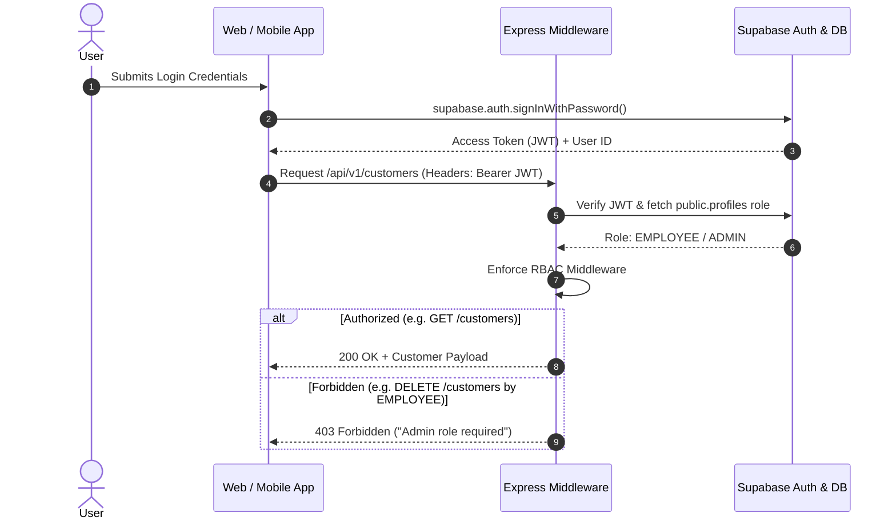
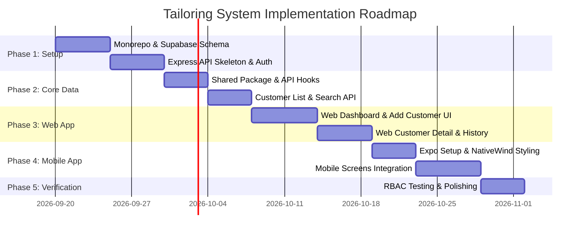

# Tailoring Customer Management System
## Technical Specification & Implementation Roadmap

---

### Executive Overview

This specification details the full-stack architecture for a **Tailoring Customer Management System** serving web (React.js) and mobile (React Native / Expo) clients. Built on a shared Node.js/Express backend paired with Supabase (PostgreSQL), the platform enforces Role-Based Access Control (RBAC) for **Admin** and **Employee** roles, ensuring strict data governance, clean code reusability, and rapid buildability.

---

### 1. Database Schema & Supabase RLS Policies

#### 1.1 Table Specifications

```sql
-- 1. ENUMS & EXTENSIONS
CREATE EXTENSION IF NOT EXISTS "uuid-ossp";

CREATE TYPE user_role AS ENUM ('ADMIN', 'EMPLOYEE');
CREATE TYPE garment_category AS ENUM ('BLOUSE', 'CHUDI');

-- 2. USERS / PROFILES (Extends Supabase auth.users)
CREATE TABLE public.profiles (
    id UUID PRIMARY KEY REFERENCES auth.users(id) ON DELETE CASCADE,
    email VARCHAR(255) NOT NULL UNIQUE,
    full_name VARCHAR(150) NOT NULL,
    role user_role NOT NULL DEFAULT 'EMPLOYEE',
    created_at TIMESTAMPTZ NOT NULL DEFAULT NOW(),
    updated_at TIMESTAMPTZ NOT NULL DEFAULT NOW()
);

-- 3. CUSTOMERS TABLE
CREATE TABLE public.customers (
    id UUID PRIMARY KEY DEFAULT uuid_generate_v4(),
    customer_code VARCHAR(20) NOT NULL UNIQUE, -- e.g. CUST-1001
    full_name VARCHAR(150) NOT NULL,
    phone_number VARCHAR(20) NOT NULL,
    created_by UUID REFERENCES public.profiles(id) ON DELETE SET NULL,
    created_at TIMESTAMPTZ NOT NULL DEFAULT NOW(),
    updated_at TIMESTAMPTZ NOT NULL DEFAULT NOW()
);

-- 4. MEASUREMENTS TABLE (Versioning supported)
CREATE TABLE public.measurements (
    id UUID PRIMARY KEY DEFAULT uuid_generate_v4(),
    customer_id UUID NOT NULL REFERENCES public.customers(id) ON DELETE CASCADE,
    garment_type garment_category NOT NULL,
    version INT NOT NULL DEFAULT 1,
    is_latest BOOLEAN NOT NULL DEFAULT TRUE,
    -- JSONB flexible schema for measurements per garment type
    -- Blouse: { chest, waist, shoulder, sleeve_length, sleeve_around, front_neck_depth, back_neck_depth, length }
    -- Chudi: { chest, waist, hip, shoulder, top_length, bottom_length, bottom_waist, thigh, knee }
    data JSONB NOT NULL,
    notes TEXT,
    created_by UUID REFERENCES public.profiles(id) ON DELETE SET NULL,
    created_at TIMESTAMPTZ NOT NULL DEFAULT NOW(),
    UNIQUE(customer_id, garment_type, version)
);

-- 5. INDEXES FOR HIGH-PERFORMANCE QUERIES
CREATE INDEX idx_customers_phone ON public.customers(phone_number);
CREATE INDEX idx_customers_name_trgm ON public.customers USING gin (full_name gin_trgm_ops);
CREATE INDEX idx_customers_created_at ON public.customers(created_at DESC);
CREATE INDEX idx_measurements_customer_garment ON public.measurements(customer_id, garment_type, is_latest);
```

#### 1.2 Row Level Security (RLS) & Triggers

```sql
-- Enable RLS
ALTER TABLE public.profiles ENABLE ROW LEVEL SECURITY;
ALTER TABLE public.customers ENABLE ROW LEVEL SECURITY;
ALTER TABLE public.measurements ENABLE ROW LEVEL SECURITY;

-- Helper function to check admin role
CREATE OR REPLACE FUNCTION public.is_admin()
RETURNS BOOLEAN AS $$
BEGIN
  RETURN EXISTS (
    SELECT 1 FROM public.profiles 
    WHERE id = auth.uid() AND role = 'ADMIN'
  );
END;
$$ LANGUAGE plpgsql SECURITY DEFINER;

-- RLS POLICIES FOR CUSTOMERS
-- All authenticated users (Admin + Employee) can SELECT customers
CREATE POLICY "Allow authenticated read on customers"
    ON public.customers FOR SELECT
    TO authenticated
    USING (true);

-- All authenticated users (Admin + Employee) can INSERT customers
CREATE POLICY "Allow authenticated insert on customers"
    ON public.customers FOR INSERT
    TO authenticated
    WITH CHECK (auth.uid() IS NOT NULL);

-- Only Admins can UPDATE customers
CREATE POLICY "Allow admin update on customers"
    ON public.customers FOR UPDATE
    TO authenticated
    USING (public.is_admin());

-- Only Admins can DELETE customers
CREATE POLICY "Allow admin delete on customers"
    ON public.customers FOR DELETE
    TO authenticated
    USING (public.is_admin());
```

---

### 2. API Layer Specification (Express Backend)

The Express backend serves as a secure gateway, performing JWT validation via Supabase Admin SDK, RBAC enforcement, input sanitization, and structured responses.

#### 2.1 Standard API Response Schema
```json
{
  "success": true,
  "data": { ... },
  "error": null,
  "meta": { "total": 120, "page": 1, "limit": 25 }
}
```

#### 2.2 Endpoints Summary

| Method | Route | Access Level | Description |
|---|---|---|---|
| `POST` | `/api/v1/auth/login` | Public | Authenticates user via Supabase Auth & returns JWT + Profile |
| `GET` | `/api/v1/auth/me` | Authenticated | Gets current user profile and role |
| `GET` | `/api/v1/customers` | Admin, Employee | Paginated list (default 25), search by `name` or `phone` |
| `GET` | `/api/v1/customers/:id` | Admin, Employee | Retrieves customer details & latest measurements |
| `POST` | `/api/v1/customers` | Admin, Employee | Creates new customer record & initial measurements |
| `PUT` | `/api/v1/customers/:id` | Admin Only | Updates customer info & adds new measurement version |
| `DELETE` | `/api/v1/customers/:id` | Admin Only | Soft/Hard deletes customer record |
| `GET` | `/api/v1/customers/:id/measurements/history` | Admin, Employee | Retrieves measurement version history for a category |
| `GET` | `/api/v1/users` | Admin Only | Lists shop employees & admins |
| `POST` | `/api/v1/users` | Admin Only | Invites/Creates new shop employee |
| `DELETE` | `/api/v1/users/:id` | Admin Only | Revokes employee access |

---

### 3. Shared Code & Component Architecture

To minimize redundancy across React.js (Web) and React Native (Mobile), code is structured using a Monorepo workspace (Turborepo + npm/pnpm workspaces).

#### 3.1 Monorepo Structure

```
ss-management-system/
├── apps/
│   ├── web/                    # React.js + Vite + Tailwind CSS
│   │   ├── src/
│   │   │   ├── components/     # Web-specific DOM components
│   │   │   ├── pages/          # Web routing pages
│   │   │   └── App.tsx
│   ├── mobile/                 # React Native + Expo + NativeWind
│   │   ├── src/
│   │   │   ├── components/     # Mobile UI components
│   │   │   ├── screens/        # Mobile screen views
│   │   │   └── App.tsx
│   └── backend/                # Node.js + Express REST API
│       ├── src/
│       │   ├── controllers/
│       │   ├── middlewares/    # Auth & RBAC middlewares
│       │   ├── routes/
│       │   └── services/
└── packages/
    ├── shared/                 # Fully platform-agnostic TypeScript package
    │   ├── src/
    │   │   ├── types/          # Shared interfaces (Customer, Measurement, UserRole)
    │   │   ├── constants/      # Garment measurement field definitions
    │   │   ├── api/            # Axios / Fetch client & endpoint hooks
    │   │   ├── store/          # Zustand state stores (Auth, Customer list)
    │   │   └── utils/          # Phone formatters, measurement validators
```

#### 3.2 State Management & Data Flow
- **Zustand (`@ss-mgmt/shared/store`)**:
  - `useAuthStore`: Holds `user`, `role`, `session`, `login()`, `logout()`. Persisted via `AsyncStorage` (Mobile) / `localStorage` (Web).
  - `useCustomerStore`: Manages active filters, search query, paginated list state, and real-time cache invalidation.
- **React Query (`@tanstack/react-query`)**:
  - Handles server-side caching, background fetching, automatic retries, and dynamic updates when a new customer is added.

---

### 4. Authentication & RBAC Enforcement Flow



#### 4.1 RBAC Middleware Example (Backend)
```typescript
export const authorizeRole = (allowedRoles: UserRole[]) => {
  return (req: Request, res: Response, next: NextFunction) => {
    if (!req.user || !allowedRoles.includes(req.user.role)) {
      return res.status(403).json({
        success: false,
        error: "Access denied. Insufficient permissions."
      });
    }
    next();
  };
};
```

---

### 5. UI/UX Specification (Black & White Minimalist Theme)

#### 5.1 Design System Rules
- **Palette**: Strict monochrome (#000000 primary text/buttons, #FFFFFF background, #F4F4F5 soft grey card background, #E4E4E7 crisp thin borders).
- **Typography**: Clean sans-serif (`Inter` or `System-UI`).
- **Contrast & Hierarchy**: Bold black headlines (`font-bold text-black`), subtle muted metadata (`text-zinc-500`).
- **Interactive Feedback**: High-contrast state changes (solid black buttons transition to dark grey `#27272A` on hover/press; inputs feature sharp 1px black focus rings).

#### 5.2 Key Screens & Micro-Layouts

1. **Employee Dashboard**:
   - **Header**: Metric card displaying `Total Customers` in large bold type (e.g., `1,284`).
   - **Top Bar**: Search bar with real-time text input filter + Category selector dropdown.
   - **Customer List**: Displays 20–25 most recently added records. Each card displays:
     - Customer Full Name (Bold)
     - Customer ID badge (e.g. `CUST-1042`)
     - Phone Number
     - Action Indicator (`>` chevron to navigate to view).

2. **Add Customer Screen**:
   - **Form Fields**: Customer Name (`input`), Phone Number (`input`).
   - **Category Switcher**: Segmented toggle buttons (`[ Blouse ]` / `[ Chudi ]`).
   - **Dynamic Measurement Grid**:
     - *Blouse Fields*: Chest, Waist, Shoulder, Sleeve Length, Sleeve Around, Front Neck Depth, Back Neck Depth, Total Length.
     - *Chudi Fields*: Chest, Waist, Hip, Shoulder, Top Length, Bottom Length, Bottom Waist, Thigh, Knee.
   - **Submit Button**: Full-width black button `[ Save Customer Record ]`.

3. **Customer Detail View**:
   - **Profile Header**: Name, Phone Number, Customer ID, Date Added.
   - **Tabs**: `Blouse` | `Chudi` | `Measurement History`.
   - **Measurement Display**: Clean 2-column key-value grid with neat border dividers.
   - **Role Action Restrictions**: Employee accounts see a read-only badge; Admin accounts see `Edit` and `Delete` action icons.

---

### 6. Implementation Roadmap



---

### 7. Architectural Trade-offs & Decisions

| Decision | Chosen Approach | Trade-off / Rationale |
|---|---|---|
| **JSONB for Measurements** | Storing garment measurements in PostgreSQL `JSONB` column | **Pros**: High flexibility when adding new garment types (e.g. Shirt, Kurti) without altering table schemas.<br>**Cons**: Reduced relational enforcement; mitigated by schema validation in the Express API layer via Zod schemas. |
| **Monorepo Shared Package** | Turborepo with shared `@ss-mgmt/shared` TypeScript library | **Pros**: 100% DRY validation schemas, API calls, and types shared across Web and Mobile.<br>**Cons**: Requires disciplined workspace package configuration. |
| **Monochrome UI System** | Strict black & white minimalist theme | **Pros**: Timeless aesthetic, lightweight CSS, eliminates complex color palette management, high legibility in shop environments.<br>**Cons**: Relies on strong typography and whitespace to create visual contrast. |
| **Express Middleware + Supabase Auth** | Express acts as API gateway, Supabase handles Identity | **Pros**: Protects database logic, allows complex business logic, prevents exposing direct database access to frontend clients.<br>**Cons**: Extra network hop compared to direct Supabase client queries, but ensures enterprise-grade security. |
